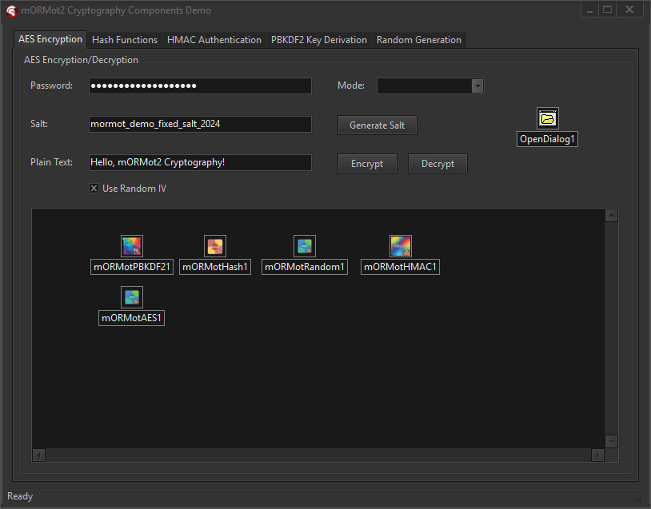

# mORMot2 Cryptography Components 🔐

**A comprehensive suite of cryptographic components for Delphi, built on the robust mORMot2 framework.**

## Overview

  

These components provide a set of essential cryptographic functionalities for Delphi applications, leveraging the highly optimized and secure cryptographic primitives available within the mORMot2 framework. They are designed to be easy to integrate and use, offering a range of algorithms for encryption, hashing, HMAC, PBKDF2, and secure random number generation.

### Key Features ✨

- **AES Encryption**: Symmetric encryption with various modes (ECB, CBC, CFB, OFB, CTR, GCM) and key sizes (128, 192, 256 bits). Supports password-based key derivation (PBKDF2) and optional random IV generation.
- **Hashing**: Secure hashing algorithms including MD5, SHA-1, SHA-256, SHA-384, SHA-512, SHA3-256, and SHA3-512.
- **HMAC**: Hash-based Message Authentication Code using SHA-1, SHA-256, SHA-384, SHA-512, SHA3-256, and SHA3-512.
- **PBKDF2**: Password-Based Key Derivation Function 2 for secure password hashing with customizable iterations and salt.
- **Random Number Generation**: Cryptographically secure pseudo-random number generation for various data types (bytes, passwords, keys, salts, UUIDs, tokens). Includes randomness quality testing.
- **Output Encoding**: Flexible output encoding options (Base64, Hexadecimal, LowerHex, UpperHex, Raw) for hashes, HMACs, and derived keys.
- **Performance Metrics**: Built-in performance tracking for operations.
- **Event-Driven**: Events for completion and error handling.

## Components 🧩

The following components are registered on the 'mORMot2 Crypto' palette in the Delphi IDE:

### `TmORMotAES` 🔑
Provides AES symmetric encryption and decryption capabilities. This component allows you to encrypt and decrypt text or raw byte data using the Advanced Encryption Standard (AES) algorithm. You can choose from various AES modes and key sizes. For enhanced security, it supports key derivation from passwords using PBKDF2 and the automatic generation of Initialization Vectors (IVs) for modes like CBC or GCM. Operations are event-driven, providing notifications upon completion or error.

**Key Properties:**
- `AESMode`: (amECB, amCBC, amCFB, amOFB, amCTR, amGCM, amCFC, amOFC, amCTC) - Specifies the AES operation mode.
- `AESKeySize`: (aks128, aks192, aks256) - Sets the AES key length.
- `Password`: Password for key derivation using PBKDF2.
- `Salt`: Salt used in PBKDF2 key derivation. Can be automatically generated.
- `PBKDF2Iterations`: Number of PBKDF2 iterations.
- `UseRandomIV`: (Boolean) - Determines if a random IV is generated for each encryption.
- `OutputEncoding`: (oeBase64, oeHexadecimal) - Format for encrypted output.
- `LastError`: (Read-only) - Stores the last error message.
- `LastResult`: (Read-only) - Stores the last encryption/decryption result.
- `PerformanceMs`: (Read-only) - Performance in milliseconds for the last operation.

**Key Methods:**
- `EncryptText(const InputText: string): string;`
- `EncryptData(const Data: RawByteString): RawByteString;`
- `DecryptText(const InputText: string): string;`
- `DecryptData(const Data: RawByteString): RawByteString;`
- `GenerateRandomSalt: string;`

**Key Events:**
- `OnEncryptionComplete`: Fired after a successful encryption.
- `OnDecryptionComplete`: Fired after a successful decryption.
- `OnError`: Fired when an error occurs.

### `TmORMotHash` 🧮
Calculates cryptographic hash values for text, data, and files. This component offers a range of secure hashing algorithms (like SHA-256, SHA-512, etc.) to generate fixed-size outputs (digests) from input data. It's suitable for data integrity checks and password storage (when combined with salting and key derivation functions). You can hash strings, raw byte data, files, or streams and verify if an input matches a given hash. The output format of the hash can be customized.

**Key Properties:**
- `HashAlgorithm`: (haMD5, haSHA1, haSHA256, haSHA384, haSHA512, haSHA3_256, haSHA3_512) - Specifies the hashing algorithm.
- `OutputEncoding`: (oeBase64, oeHexadecimal, oeLowerHex, oeUpperHex) - Format for the hash output.
- `InputText`: Text to be hashed (design-time property for convenience).
- `LastError`: (Read-only) - Stores the last error message.
- `LastHash`: (Read-only) - Stores the last computed hash.
- `PerformanceMs`: (Read-only) - Performance in milliseconds for the last operation.
- `HashLength`: (Read-only) - Length of the computed hash in bytes.

**Key Methods:**
- `HashText(const InputText: string): string;`
- `HashData(const Data: RawByteString): string;`
- `HashFile(const FileName: string): string;`
- `HashStream(Stream: TStream): string;`
- `VerifyText(const InputText, ExpectedHash: string): Boolean;`
- `VerifyFile(const FileName, ExpectedHash: string): Boolean;`

**Key Events:**
- `OnHashComplete`: Fired after a successful hash calculation.
- `OnError`: Fired when an error occurs.

### `TmORMotHMAC` 🛡️
Computes Hash-based Message Authentication Codes (HMAC). This component provides a mechanism to verify both the data integrity and the authenticity of a message. HMAC uses a cryptographic hash function and a secret key, ensuring that any alteration to the data or the use of an incorrect key will result in a different HMAC value. It supports various underlying hash algorithms and can process messages from text, raw data, files, or streams.

**Key Properties:**
- `HMACAlgorithm`: (hmacSHA1, hmacSHA256, hmacSHA384, hmacSHA512, hmacSHA3_256, hmacSHA3_512) - Specifies the underlying hash algorithm for HMAC.
- `SecretKey`: The secret key for HMAC calculation.
- `OutputEncoding`: (oeBase64, oeHexadecimal, oeLowerHex, oeUpperHex) - Format for the HMAC output.
- `Message`: Message to be HMACed (design-time property for convenience).
- `LastError`: (Read-only) - Stores the last error message.
- `LastHMAC`: (Read-only) - Stores the last computed HMAC.
- `PerformanceMs`: (Read-only) - Performance in milliseconds for the last operation.
- `HMACLength`: (Read-only) - Length of the computed HMAC in bytes.

**Key Methods:**
- `CalculateHMAC(const Message, Key: string): string;`
- `CalculateHMACData(const Data: RawByteString; const Key: string): string;`
- `CalculateHMACFile(const FileName, Key: string): string;`
- `CalculateHMACStream(Stream: TStream; const Key: string): string;`
- `VerifyHMAC(const Message, Key, ExpectedHMAC: string): Boolean;`
- `VerifyHMACData(const Data: RawByteString; const Key, ExpectedHMAC: string): Boolean;`
- `VerifyHMACFile(const FileName, Key, ExpectedHMAC: string): Boolean;`
- `GenerateRandomKey(KeyLength: Integer): string;`

**Key Events:**
- `OnHMACComplete`: Fired after a successful HMAC calculation.
- `OnError`: Fired when an error occurs.

### `TmORMotPBKDF2` 💪
Performs Password-Based Key Derivation Function 2. This component is crucial for securely storing user passwords. Instead of storing passwords directly or even their simple hashes, PBKDF2 applies a chosen hash function repeatedly (iterations) to a password, combined with a unique salt. This process makes brute-force and rainbow table attacks computationally expensive, significantly enhancing password security. You can customize the number of iterations, salt length, and the derived key's length.

**Key Properties:**
- `PBKDF2Algorithm`: (pbkdfSHA1, pbkdfSHA256, pbkdfSHA384, pbkdfSHA512) - Specifies the underlying hash algorithm for PBKDF2.
- `Password`: The password to derive the key from.
- `Salt`: The salt to use for key derivation.
- `Iterations`: Number of iterations for key derivation. Higher values increase security.
- `KeyLength`: Desired length of the derived key in bytes.
- `AutoGenerateSalt`: (Boolean) - If true, a random salt will be generated automatically.
- `MinIterations`: (Read-only) - Recommended minimum iterations for the selected algorithm.
- `LastError`: (Read-only) - Stores the last error message.
- `LastDerivedKey`: (Read-only) - Stores the last derived key.
- `PerformanceMs`: (Read-only) - Performance in milliseconds for the last operation.
- `OutputEncoding`: (oeBase64, oeHexadecimal, oeLowerHex, oeUpperHex, oeRaw) - Format for the derived key output.

**Key Methods:**
- `DeriveKey(const Password, Salt: string; Iterations, KeyLength: Integer): string;`
- `GenerateRandomSalt(SaltLength: Integer): string;`
- `EstimateDerivationTime(Iterations: Integer): Cardinal;` - Estimates the time taken for a given number of iterations (for SHA256 only).

**Key Events:**
- `OnKeyDerivationComplete`: Fired after successful key derivation.
- `OnError`: Fired when an error occurs.

### `TmORMotRandom` 🎲
Generates cryptographically secure random data. This component is essential for any cryptographic application requiring high-quality random numbers for keys, salts, Initialization Vectors (IVs), and other security-sensitive data. It can generate random bytes, passwords with customizable character sets, encryption keys, salts, UUIDs, and tokens. It also includes a utility to test the randomness quality of given data.

**Key Properties:**
- `OutputFormat`: (rofBinary, rofHexadecimal, rofBase64, rofBase64URL, rofUpperHex, rofLowerHex) - Format of the generated random output.
- `DataType`: (rdtBytes, rdtPassword, rdtKey, rdtSalt, rdtUUID, rdtToken) - Predefined types of random data to generate.
- `Length`: Desired length of the generated random data.
- `MinLength`, `MaxLength`: (For password/key generation) - Defines the range for random length.
- `IncludeUppercase`, `IncludeLowercase`, `IncludeNumbers`, `IncludeSymbols`: (For password generation) - Character set options.
- `ExcludeAmbiguous`: (Boolean) - Excludes ambiguous characters (e.g., 'l', '1', 'I', 'O', '0') from password generation.
- `CustomCharset`: (String) - Allows defining a custom character set for password generation.
- `LastError`: (Read-only) - Stores the last error message.
- `LastRandom`: (Read-only) - Stores the last generated random data.
- `PerformanceMs`: (Read-only) - Performance in milliseconds for the last operation.

**Key Methods:**
- `GenerateRandomData: string;`
- `FillBuffer(Buffer: Pointer; Size: Integer);` - Fills a raw buffer with random bytes.
- `TestRandomness(const Data: RawByteString): Double;` - Estimates the entropy of provided data (0.0 to 8.0 bits per byte).

**Key Events:**
- `OnRandomGenerated`: Fired after successful random data generation.
- `OnError`: Fired when an error occurs.

## Installation ⬇️

### Prerequisites ✅
- Delphi XE2 or later (tested with Delphi 12.2)
- mORMot2 framework installed and configured in your Delphi environment.

### Step 1: Download the Components ☁️
Download the components from this repository.

### Step 2: Install in Delphi IDE 💻
1. Open the `mORMot2Components.dproj` (or similar project file if renamed) in Delphi.
2. Right-click on the project in the Project Manager and select `Install`. This will install the components onto your Delphi IDE palette under 'mORMot2 Crypto'.

### Step 3: Add to Library Path 📂
Ensure the component source directory is in your Delphi library path to enable successful compilation of projects using these components:
1. Go to **Tools** → **Options** in Delphi.
2. In the search bar at the top right, type "library path" and select the relevant option.
3. Add the output directory (e.g., `Win32\Release` or `Win64\Release` depending on your build configuration) of your compiled components to the **Library path**.

**Important Note on Path Conflicts**: If you have existing mORMot2 library paths configured, you might encounter unit conflicts or issues with IntelliSense. It is recommended to manage your library paths carefully to avoid such conflicts. Sometimes, temporarily removing conflicting mORMot2 paths during component installation and then re-adding them after installation can help.

## Quick Start Guide 🚀

Refer to the included demo projects for practical examples of how to use each component.

## Advanced Usage 💡

The components provide robust methods and properties for a wide range of cryptographic tasks. For detailed implementation, please consult the component properties, methods, and event handlers available in the Delphi IDE and the provided demo applications.

## Requirements 📋

- **mORMot2 Framework**: These components are built upon mORMot2's cryptographic functions. Ensure you have a recent version of mORMot2 installed and accessible in your Delphi environment.
- **Delphi**: XE2 or later (tested with Delphi 11+ and 12.2).
- **Platform**: Windows (32-bit and 64-bit).
- **Application Type**: Compatible with VCL and console applications.

## License 📜

This is Open Source Code. Feel free to distribute and use it as per the mORMot2 license.

## Contributing 🤝

Contributions are welcome! Please feel free to:
- Fork the repository.
- Create new features or fix bugs.
- Submit pull requests.

## Support ❓

- Discord: bitmasterxor
- **Issues**: Report bugs and feature requests via GitHub Issues on this repository.

## Changelog 📝

**Note**: These components require the mORMot2 framework. Ensure mORMot2 is properly installed and configured in your Delphi environment before using these components.

---
Built with ❤️ by BitmasterXor using Delphi RAD Studio.
